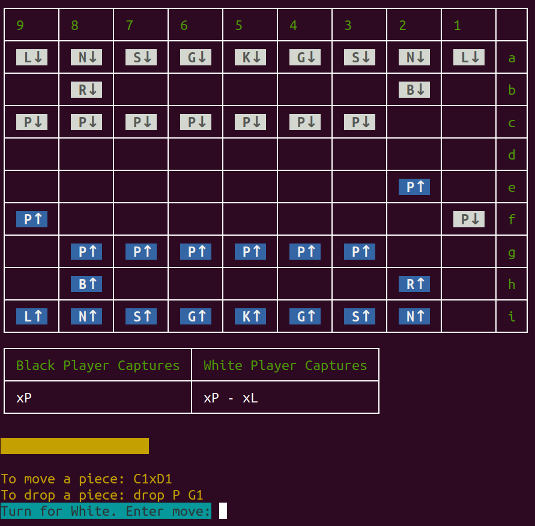

## Table of Contents

* [Environment setup](#environment-setup)
  * [Needed tools](#needed-tools)
  * [Application execution](#application-execution)
  * [Tests execution](#tests-execution)
* [Project explanation](#project-explanation)
  * [Developed features](#developed-features)
  * [Diving project structure](#diving-project-structure)
  * [UI Preview](#ui-preview)

## Environment setup

### Needed tools

1. [Install Docker](https://www.docker.com/get-started)
2. Clone this project: `git clone https://github.com/marydn/shogi`
3. Move to the project folder: `cd shogi`
4. Install PHP dependencies and bring up the project Docker containers with Docker Compose: `make build`
5. Check everything's up using: `$ docker-compose ps`. It should show `php` service up.

Note: If you want to bring down Docker service use: `make destroy`

### Application execution

Start game using: `make play`

End the game at any time by writing `quit` instead of entering a new move.

### Tests execution

Execute PHP Unit tests: `make test`

## Project explanation

OOP Design example for a variation of a Japanese chess version called [Shogi](https://en.wikipedia.org/wiki/Shogi).

### Developed features:

  * Console interactive interface
  * Pieces placement
  * Pieces movements
  * Capture opponent's pieces
  * Drop captured pieces (only Pawns)
  * Pieces are automatically promoted when they reach promotion zone (last 3 rows)

### Diving project structure:

```bash
$ tree -L 4 src
src
├── Board.php
├── CliPrintableSpot.php # Decorator for console output
├── Command
│   └── GameCommand.php # Console output application
├── CoordinateTranslator.php # Translate user's input to a valid coordinate to handle internally
├── Exception
│   ├── CoordinateNotFound.php
│   ├── CoordinateNotWellFormedNotation.php
│   ├── IllegalMove.php
│   └── PieceNotFoundInInventory.php
├── Game.php
├── Move.php
├── MovesList.php # Collection of Moves
├── Notation.php # Every move is saved as a Notation object
├── Pieces # Every piece in the Board
│   ├── BasePiece.php
│   ├── Bishop.php
│   ├── GoldGeneral.php
│   ├── King.php
│   ├── Knight.php
│   ├── Lance.php
│   ├── Pawn.php
│   ├── PieceDroppableInterface.php # This Interface is for pieces that can be droppable
│   ├── PieceInterface.php
│   ├── PiecePromotableInterface.php # This Interface is for pieces that can be promoted
│   ├── Rook.php
│   └── SilverGeneral.php
├── PlayerInventory.php # Player's inventory
├── Player.php # Every player of the game
├── Shared
│   ├── Collection.php # Abstract class for Objects that holds collections
│   └── Enum.php # Abstract class for Objects used as an Enum value object
├── Spot.php # Every spot in the Board
└── ValueObject
    ├── Coordinate.php # User's input
    └── NotationType.php # ValueObject to identify the type of move
```

### UI Preview:


